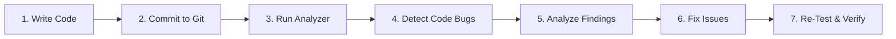

# Documentation: Go CI Checks | Bug Analysis

## Author Information

| **Author** | **Created On** | **Version** | **L0 Reviewer** | **L1 Reviewer** | **L2 Reviewer** |
| ---------------- | -------------------- | ----------------- | --------------------- | --------------------- | --------------------- |
| Amrendra         | 01-10-2026           | 1.0               | Shubham Rathi / Sunny | Shreya J / Nikita     | Piyush Upadhyay       |

---

# Table of Contents

1. [Introduction](#1-introduction)
2. [What is Bug Analysis](#2-what-is-bug-analysis)
3. [Why Bug Analysis](#3-why-bug-analysis)
4. [Bug Analysis Workflow](#4-bug-analysis-workflow)
   - [4.1 Workflow Diagram](#41-workflow-diagram)
   - [4.2 Workflow Explanation](#42-workflow-explanation)
5. [Different Tools for Go Bug Analysis](#5-different-tools-for-go-bug-analysis)
6. [Comparison of Bug Analysis Tools](#6-comparison-of-bug-analysis-tools)
7. [Advantages of Bug Analysis](#7-advantages-of-bug-analysis)
8. [Proof of Concept (POC)](#8-proof-of-concept-poc)
9. [Best Practices](#9-best-practices)
10. [Recommendation](#10-recommendation)
11. [Conclusion](#11-conclusion)
12. [Contact Information](#12-contact-information)
13. [References](#13-references)

---

# 1. Introduction

This document provides a guide to implement Bug Analysis for Go source code.
It covers static code analysis for the Employee API application.

---

# 2. What is Bug Analysis

- Bug Analysis is a static testing method for source code.
- It scans code without running the application.
- It detects logic flaws, unhandled errors, and code defects.
- It gives fast feedback to developers before deployment.

---

# 3. Why Bug Analysis

Bug Analysis detects code problems early before they cause runtime failures.

| Reason                       | Description                                                   |
| ---------------------------- | ------------------------------------------------------------- |
| **Early Detection**    | Finds code bugs before runtime or release.                    |
| **Error Handling**     | Detects ignored errors and unchecked return values.           |
| **Code Quality**       | Identifies dead code, redundant returns, and bad assignments. |
| **Fast Feedback**      | Alerts developers immediately during code changes.            |
| **Continuous Quality** | Runs automatically inside CI/CD pipelines.                    |

---

# 4. Bug Analysis Workflow

The Bug Analysis workflow inspects Go source code and reports actionable findings.

### 4.1 Workflow Diagram

### 4.2 Workflow Explanation

|    Step    | Stage                      | Description                                                    |
| :---------: | -------------------------- | -------------------------------------------------------------- |
| **1** | **Write Code**       | Developer creates or modifies Go source code.                  |
| **2** | **Commit to Git**    | Code is committed and pushed to the Git repository.            |
| **3** | **Run Analyzer**     | Execute`golangci-lint run ./...` in terminal or CI.          |
| **4** | **Detect Code Bugs** | Linters inspect code for bugs, errors, and styling flaws.      |
| **5** | **Analyze Findings** | Review reported issues with file names and line numbers.       |
| **6** | **Fix Issues**       | Developer corrects the identified code defects.                |
| **7** | **Re-Test & Verify** | Run the analyzer again to verify that all issues are resolved. |

---

# 5. Different Tools for Go Bug Analysis

| Tool                    | Description                                                             |
| ----------------------- | ----------------------------------------------------------------------- |
| **golangci-lint** | Fast, aggregate linter that runs multiple Go tools in a single command. |
| **go vet**        | Official Go tool that checks for suspicious code constructs.            |
| **Staticcheck**   | Advanced static analysis tool detecting bugs and performance issues.    |
| **errcheck**      | Specialized tool to detect unhandled and unchecked error return values. |
| **ineffassign**   | Specialized tool to detect variable assignments that are never used.    |

---

# 6. Comparison of Bug Analysis Tools

| Feature                    | golangci-lint              | go vet                | Staticcheck         | errcheck            | ineffassign             |
| -------------------------- | -------------------------- | --------------------- | ------------------- | ------------------- | ----------------------- |
| **License**          | Open Source (Free)         | Open Source (Free)    | Open Source (Free)  | Open Source (Free)  | Open Source (Free)      |
| **Primary Focus**    | Aggregated Static Analysis | Suspicious Constructs | Bugs & Code Quality | Unchecked Errors    | Ineffective Assignments |
| **Multiple Linters** | Yes (Built-in)             | No                    | No                  | No                  | No                      |
| **CI/CD Automation** | High                       | High                  | High                | High                | High                    |
| **Single Command**   | Yes                        | No                    | No                  | No                  | No                      |
| **Used in this POC** | **Yes (Primary)**    | Validation            | Included via linter | Included via linter | Included via linter     |

---

# 7. Advantages of Bug Analysis

| Advantage                    | Description                                          |
| ---------------------------- | ---------------------------------------------------- |
| **Finds Bugs Early**   | Catches defects before code is deployed.             |
| **Fast Execution**     | Scans code quickly without running services.         |
| **High Accuracy**      | Reports exact file names and line numbers.           |
| **Automated in CI/CD** | Runs easily in Jenkins or GitHub Actions.            |
| **Consistent Quality** | Enforces the same standards across all team members. |

---

# 8. Proof of Concept (POC)

A Proof of Concept (POC) was performed on the Go-based **Employee API**.

For full execution steps, refer to the [Go Bug Analysis POC Documentation](./POC/README.md).

---

# 9. Best Practices

| Best Practice                 | Description                                                 |
| ----------------------------- | ----------------------------------------------------------- |
| **Run Locally First**   | Run`golangci-lint` before pushing code to Git.            |
| **Pin Tool Version**    | Use a fixed linter version to ensure consistent CI results. |
| **Never Ignore Errors** | Handle all return errors explicitly in Go code.             |
| **Automate in CI/CD**   | Fail the CI build if new bug findings are detected.         |
| **Re-Scan After Fixes** | Run the analyzer again to confirm that code fixes worked.   |

---

# 10. Recommendation

| Parameter                    | Details                                            |
| ---------------------------- | -------------------------------------------------- |
| **Recommended Tool**   | **golangci-lint**                            |
| **Target Application** | Employee API (Go)                                  |
| **Language**           | Go                                                 |
| **Primary Command**    | `golangci-lint run ./...`                        |
| **CI/CD Integration**  | High (Jenkins, GitHub Actions)                     |
| **Key Reason**         | Runs multiple Go linters in a single fast command. |

---

# 11. Conclusion

Bug Analysis improves Go software quality by catching defects early in source code.

**Chosen Tool:**
We choose **golangci-lint** as our Go Bug Analysis tool for the **Employee API**. It combines multiple analyzers into one command, runs fast, and integrates seamlessly into CI/CD pipelines.

---

# 12. Contact Information

|        Name        |          Email Address          |
| :----------------: | :-----------------------------: |
| **Amrendra** | amrendra.snaatak@mygurukulam.co |

---

# 13. References

| Reference                  | Link                                                     |
| -------------------------- | -------------------------------------------------------- |
| **golangci-lint**    | [golangci-lint](https://golangci-lint.run/)               |
| **Go Vet**           | [Vet](https://pkg.go.dev/cmd/vet)                         |
| **Staticcheck**      | [Staticcheck](https://staticcheck.dev/)                   |
| **errcheck**         | [errcheck](https://github.com/kisielk/errcheck)           |
| **ineffassign**      | [ineffassign](https://github.com/gordonklaus/ineffassign) |
| **Go Documentation** | [Docs](https://go.dev/doc/)                               |
