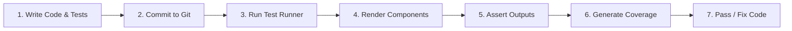

# Documentation: React CI Checks | Unit Testing

## Author Information

| **Author** | **Created On** | **Version** | **L0 Reviewer** | **L1 Reviewer** | **L2 Reviewer** |
| ---------------- | -------------------- | ----------------- | --------------------- | --------------------- | --------------------- |
| Amrendra         | 01-10-2026           | 1.0               | Shubham Rathi / Sunny | Shreya J / Nikita     | Piyush Upadhyay       |

---

# Table of Contents

1. [Introduction](#1-introduction)
2. [What is Unit Testing](#2-what-is-unit-testing)
3. [Why Unit Testing](#3-why-unit-testing)
4. [Unit Testing Workflow](#4-unit-testing-workflow)
   - [4.1 Workflow Diagram](#41-workflow-diagram)
   - [4.2 Workflow Explanation](#42-workflow-explanation)
5. [Different Tools for React Unit Testing](#5-different-tools-for-react-unit-testing)
6. [Comparison of Unit Testing Tools](#6-comparison-of-unit-testing-tools)
7. [Advantages of Unit Testing](#7-advantages-of-unit-testing)
8. [Proof of Concept (POC)](#8-proof-of-concept-poc)
9. [Best Practices](#9-best-practices)
10. [Recommendation](#10-recommendation)
11. [Conclusion](#11-conclusion)
12. [Contact Information](#12-contact-information)
13. [References](#13-references)

---

# 1. Introduction

This document provides a guide to implement Unit Testing for React web applications.
It covers testing strategies, tool evaluation, workflow, and best practices for React CI checks.

---

# 2. What is Unit Testing

- Unit testing tests individual components and functions in isolation.
- It tests React component rendering, user clicks, and state changes.
- It verifies that small units of code work as expected.
- It runs quickly without opening a real web browser.

---

# 3. Why Unit Testing

Unit testing detects frontend bugs early before code reaches production.

| Reason                          | Description                                              |
| ------------------------------- | -------------------------------------------------------- |
| **Early Bug Detection**   | Finds UI and logic bugs during development.              |
| **Component Stability**   | Ensures individual components work as designed.          |
| **Regression Prevention** | Stops existing features from breaking when code changes. |
| **Fast Feedback**         | Gives instant feedback to developers in seconds.         |
| **Safe Refactoring**      | Allows developers to clean up code with high confidence. |

---

# 4. Unit Testing Workflow

The Unit Testing workflow executes automated tests against React components during the CI build.

### 4.1 Workflow Diagram

### 4.2 Workflow Explanation

|    Step    | Stage                        | Description                                                             |
| :---------: | ---------------------------- | ----------------------------------------------------------------------- |
| **1** | **Write Code & Tests** | Developer creates React components and unit test files (`*.test.js`). |
| **2** | **Commit to Git**      | Code and tests are committed and pushed to the repository.              |
| **3** | **Run Test Runner**    | The CI pipeline triggers the test suite with`npm test`.               |
| **4** | **Render Components**  | Test utility renders components in a virtual DOM environment (JSDOM).   |
| **5** | **Assert Outputs**     | Test runner validates UI elements, props, text, and user events.        |
| **6** | **Generate Coverage**  | The tool calculates line, branch, and function code coverage.           |
| **7** | **Pass / Fix Code**    | Build passes if all tests succeed, or developer fixes failed tests.     |

---

# 5. Different Tools for React Unit Testing

| Tool                            | Description                                                                          |
| ------------------------------- | ------------------------------------------------------------------------------------ |
| **Jest**                  | Popular JavaScript test runner with built-in assertion, mocking, and coverage tools. |
| **React Testing Library** | User-centric library that tests React components like a real user.                   |
| **Vitest**                | Fast, modern test runner powered by Vite with Jest-compatible APIs.                  |
| **Mocha + Chai**          | Flexible test framework and assertion library requiring custom setup.                |

---

# 6. Comparison of Unit Testing Tools

| Feature                           | Jest + RTL                     | Vitest + RTL             | Mocha + Chai                   |
| --------------------------------- | ------------------------------ | ------------------------ | ------------------------------ |
| **License**                 | Open Source (Free)             | Open Source (Free)       | Open Source (Free)             |
| **Primary Focus**           | React Component & Unit Testing | Modern Fast Unit Testing | General JavaScript Testing     |
| **React Ecosystem Support** | Industry Standard (Default)    | High (Vite Projects)     | Medium                         |
| **Virtual DOM (JSDOM)**     | Built-in                       | Supported                | Requires configuration         |
| **Code Coverage**           | Built-in (Istanbul)            | Built-in (v8 / Istanbul) | Requires external plugin (nyc) |
| **CI/CD Integration**       | High                           | High                     | Medium                         |
| **Ease of Setup**           | Zero Config (CRA / Standard)   | Easy                     | Moderate                       |

---

# 7. Advantages of Unit Testing

| Advantage                       | Description                                                  |
| ------------------------------- | ------------------------------------------------------------ |
| **User Behavior Focus**   | React Testing Library tests how users actually use the UI.   |
| **Fast Execution**        | Tests run in memory within seconds without browser overhead. |
| **Detailed Coverage**     | Shows exact percentages of tested code and missing branches. |
| **Automated in CI/CD**    | Fails pull requests automatically if any test breaks.        |
| **Lower Bug Fixing Cost** | Catches errors before code reaches QA or production.         |

---

# 8. Proof of Concept (POC)

A Proof of Concept (POC) is performed on a React frontend web application.

For full execution steps, refer to the [POC](https://github.com/SnaatakAllStars/Sprint-2/blob/SCRUM-163-AMRENDRA/Documentation/Application_CI_Design/CI_Checks/React/Unit_Testing/POC/README.md).

---

# 9. Best Practices

| Best Practice                         | Description                                                  |
| ------------------------------------- | ------------------------------------------------------------ |
| **Test Behavior, Not State**    | Query elements by role and label rather than internal state. |
| **Keep Tests Isolated**         | Ensure tests do not depend on each other.                    |
| **Mock External APIs**          | Mock HTTP network calls to keep tests reliable and fast.     |
| **Maintain Quality Thresholds** | Enforce a minimum 80% code coverage rule in CI.              |
| **Run on Every Pull Request**   | Automate test runs on every pull request before merging.     |

---

# 10. Recommendation

| Parameter                     | Details                                                                                |
| ----------------------------- | -------------------------------------------------------------------------------------- |
| **Recommended Tool**    | **Jest + React Testing Library (RTL)**                                           |
| **Target Application**  | React Web Application                                                                  |
| **Execution Command**   | `npm test -- --coverage --watchAll=false`                                            |
| **Virtual Environment** | JSDOM (Simulated browser environment)                                                  |
| **CI/CD Integration**   | High (Easy integration into Jenkins and GitHub Actions)                                |
| **Key Reason**          | Official standard in the React ecosystem with zero-config setup and built-in coverage. |

---

# 11. Conclusion

Unit Testing ensures high code quality, stability, and reliability for React web applications.

**Chosen Tool:**
We choose **Jest with React Testing Library (RTL)** as our unit testing solution for the React application. It is the industry standard, tests user-facing behavior, runs fast in CI pipelines, and provides built-in code coverage reports.

---

# 12. Contact Information

|        Name        |          Email Address          |
| :----------------: | :-----------------------------: |
| **Amrendra** | amrendra.snaatak@mygurukulam.co |

---

# 13. References

| Reference                       | Link                                                                |
| ------------------------------- | ------------------------------------------------------------------- |
| **Jest**                  | [Jest](https://jestjs.io/)                                           |
| **React Testing Library** | [RTL](https://testing-library.com/docs/react-testing-library/intro/) |
| **Vitest**                | [Vitest](https://vitest.dev/)                                        |
| **React Documentation**   | [React](https://react.dev/learn/testing)                             |
