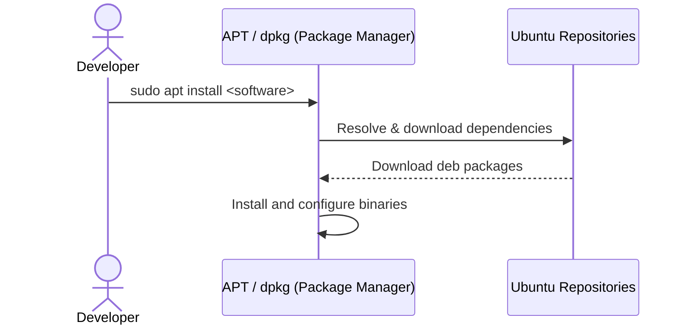
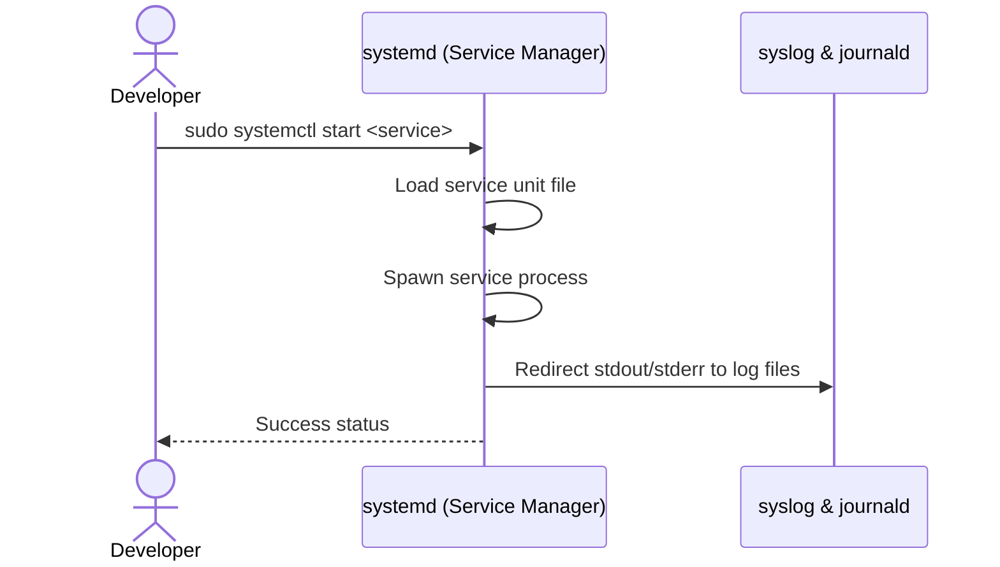

# DOCUMENT: Ubuntu Concepts

  

# Author Table

| **Author** | **Created&nbsp;On** | **Version** | **Last&nbsp;Edited&nbsp;On** | **L0 Reviewer** | **L1 Reviewer** | **L2 Reviewer** |
| --- | --- | --- | --- | --- | --- | --- |
| Amrendra | 24&#8209;08&#8209;2026 | 1.0 | 24&#8209;08&#8209;2026 | Shubham Rathi<L0 Reviewer></l0> | Shreya J/ Nikita<L1 Reviewer></l1> | Piyush Upadhyay<L2 Reviewer></l2> |

---

# Table of Contents

1. [Introduction](#1-introduction)
2. [What is Ubuntu](#2-what-is-ubuntu)
3. [Why Ubuntu](#3-why-ubuntu)
4. [Software Management in Ubuntu](#4-software-management-in-ubuntu)
5. [Services in Ubuntu](#5-services-in-ubuntu)
6. [Best Practices](#6-best-practices)
7. [Conclusion](#7-conclusion)
8. [Contact Information](#8-contact-information)
9. [References](#9-references)

---

# 1. Introduction

This document outlines the foundational operating system concepts of Ubuntu. It details the system's architecture, package management methods, and background service execution model, providing administrators and developers with the core guidelines required for consistent local setup and deployments.

---

# 2. What is Ubuntu

Ubuntu is a Debian-based Linux distribution composed of free and open-source software. It features:

- **The Linux Kernel:** Handles process management, system memory, storage, and driver abstraction.
- **User Space & Shell:** Consists of shell terminals (like Bash), system utilities, libraries, and package systems that allow administrators and programs to interface with the kernel.
- **Service Management (`systemd`):** Manages bootstrap processes, monitors active services, and coordinates resource allocation.
- **Package Management (APT/dpkg):** Installs and maintains system libraries, runtimes, and dependencies safely.

---

# 3. Why Ubuntu

Ubuntu is widely chosen as an enterprise and server operating system because:

- **Open Source and Free:** It is free to use and distribute with no licensing costs.
- **Stability and Security:** Long-Term Support (LTS) releases provide 5 years of predictable updates, security patches, and high stability.
- **User-Friendly & Strong Community:** Extensive documentation, tutorials, and a large global community make administration and troubleshooting accessible.
- **Rich Package Ecosystem:** Built-in package management tools (APT) and expansive official repositories make installing and maintaining software dependencies effortless.

---

# 4. Software Management in Ubuntu

Software management in Ubuntu revolves around maintaining the lifecycle of software packages—installing, updating, and removing packages safely while resolving dependency trees.

### Core Concepts:

- **APT (Advanced Package Tool):** A high-level package management command-line utility. It resolves, downloads, and configures required package dependencies automatically from remote repositories.
- **dpkg:** The low-level package manager that installs local Debian (`.deb`) files directly. It does not resolve dependencies automatically.
- **Repositories:** Software sources hosted on servers, categorized into *Main* (canonical open-source), *Restricted* (proprietary drivers), *Universe* (community open-source), and *Multiverse* (copyright-restricted).

### Software Installation Workflow:

1. Administrator executes a package install command (e.g., `sudo apt install nginx`).
2. APT updates the local index database and resolves package dependency hierarchies.
3. APT downloads the appropriate `.deb` files from remote repositories.
4. APT calls `dpkg` to unpack the software, place binaries in standard directories, and complete configuration.

---

# 5. Services in Ubuntu

Services (or daemons) are processes running continuously in the background to handle system or application-level activities (like database listeners, web servers, or schedulers).

### Core Concepts:

- **systemd:** The default initialization system (PID 1) and service manager in Ubuntu, starting processes in parallel and supervising their execution.
- **systemctl:** The main administrative command-line utility used to control systemd services.
- **Service States:** Service units exist in states such as `active (running)`, `inactive (dead)`, `enabled` (configured to start on boot), and `disabled`.
- **Logging:** systemd redirects standard output and error streams of services directly to `journald` and `/var/log/syslog` for tracing.

### Service Management Workflow:

1. Developer defines unit configurations in a `.service` file under `/etc/systemd/system/`.
2. Administrator triggers configuration reload via `systemctl daemon-reload`.
3. The service is managed (started/stopped/restarted/enabled) via `systemctl` commands.
4. systemd launches the daemon, monitors its runtime health, and records log streams.

---

# 6. Best Practices

| **Best Practice** | **Description** |
| --- | --- |
| **Standardize on LTS Versions** | Deploy Ubuntu LTS (Long-Term Support) versions in environments to guarantee security patches for up to 5 years. |
| **Perform Index Updates Prior to Installs** | Run `sudo apt update` before software installations to prevent package dependency mismatch errors. |
| **Remove Orphaned Dependencies** | Regularly invoke `sudo apt autoremove` and `sudo apt clean` to free up disk space and eliminate unused libraries. |
| **Run Daemon Services as Non-Root Users** | Modify systemd service configurations to execute processes using isolated system accounts (e.g., `User=nobody`). |
| **Inspect System Logs Regularly** | Utilize `journalctl -xe` and monitor `/var/log/syslog` to catch process failures and trace security events. |

---

# 7. Conclusion

Ubuntu LTS provides a stable, secure, and well-supported operating system environment. Utilizing **APT** for software management and **systemd** for service management ensures dependable system operations, simple software lifecycles, and reliable background process supervision.

---

# 8. Contact Information

| **Name** | **Email** |
| --- | --- |
| Amrendra | [amrendra.yadav.snaatak@mygurukulam.co](mailto:amrendra.yadav.snaatak@mygurukulam.co) |

---

# 9. References

| **Topic** | **Description** |
| --- | --- |
| [Ubuntu Server Guide](https://ubuntu.com/server/docs) | Official administration and setup guides for Ubuntu Server. |
| [systemd Documentation](https://www.freedesktop.org/wiki/Software/systemd/) | Complete details on the systemd initialization system. |
| [Debian APT Wiki](https://wiki.debian.org/Apt) | Deep dive documentation on the Advanced Package Tool. |
