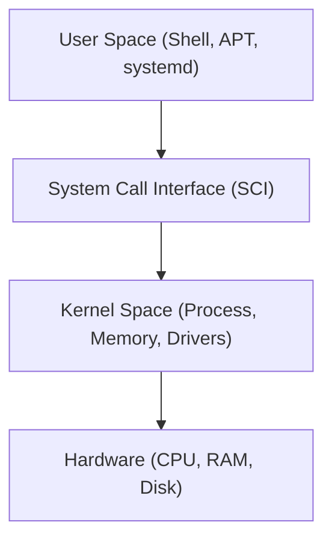

# OT-MICROSERVICES / documentation-template Wiki

## Operating System - Ubuntu Concepts

| Author   | Created on | Version   | Last updated by | Last edited on |
| -------- | ---------- | --------- | --------------- | -------------- |
| amrendra | 24-08-26   | version 1 | amrendra        | 24-08-26       |

---

### Purpose

Provides a concise overview of the Ubuntu OS concepts for the Setup Epic, detailing what Ubuntu is, why it is used, and core principles of software and service management.

- **What is Ubuntu:** A popular, Debian-based, open-source Linux operating system.
- **Why Ubuntu:** Free, stable LTS releases (5-year support), secure, robust package management (`apt`), and service control (`systemd`).
- **Problems Solved:** Offers a stable, reproducible host environment for microservices, eliminating licensing costs and vendor lock-in.

---

### System Requirements & Pre-requisites

Ensure the target local or virtual system meets these requirements prior to deployment:

- **Processor:** 2.0 GHz dual-core or better
- **RAM:** 4 GB
- **Disk:** 25 GB
- **OS:** Ubuntu 22.04 LTS

---

### Dependencies & Ports

#### System Dependencies

| Type          | Name              | Version       | Description                            |
| ------------- | ----------------- | ------------- | -------------------------------------- |
| Build-time    | gcc / make        | 11.x+ / 4.3+  | GNU compiler collection and build tool |
| Run-time      | glibc / openssl   | 2.35+ / 3.0+  | Standard C and cryptographic libraries |
| Core Services | systemd / python3 | 249+ / 3.10.x | System manager and scripting runtime   |

#### Important Ports

| Direction | Port     | Protocol | Usage                                             |
| --------- | -------- | -------- | ------------------------------------------------- |
| Inbound   | 22       | TCP      | SSH for remote system management                  |
| Inbound   | 80 / 443 | TCP      | HTTP / HTTPS traffic for web applications         |
| Outbound  | 53 / 123 | UDP/TCP  | DNS resolution / NTP time synchronization         |
| Outbound  | 80 / 443 | TCP      | Package repository downloads (archive.ubuntu.com) |

---

### Architecture & Dataflow

Ubuntu separates user-space activities from core hardware interactions through a layered model, and manages system state transitions programmatically:

#### Process Dataflow:

1. **Software Management:** Admin calls `apt` -> reads repository metadata -> downloads `.deb` -> invokes `dpkg` to extract/configure.
2. **Service Management:** Admin calls `systemctl` -> `systemd` reads service unit configuration -> spawns background daemon process.

---

### Software Management & Services (Acceptance Criteria)

#### Software Management:

- **APT (Advanced Package Tool):** High-level command-line tool for package installation. It resolves, downloads, and configures dependencies automatically.
- **dpkg:** Low-level package manager that installs local `.deb` files directly. Does not download dependencies automatically.
- **Repositories:** Software sources categorized as: *Main* (supported open-source), *Restricted* (proprietary drivers), *Universe* (community open-source), and *Multiverse* (copyright-restricted).

#### Services Management:

- **systemd:** The initialization system (PID 1) and service manager responsible for booting the OS and running daemons.
- **systemctl:** The command-line utility used to control systemd and manage service states.
- **Service States:** `active (running)`, `inactive (dead)`, `enabled` (auto-start at boot), and `disabled` (manual start only).

---

### Monitoring & Logging

#### OS Metrics & Probes

| Parameter       | Description                                          | Priority | Threshold      |
| --------------- | ---------------------------------------------------- | -------- | -------------- |
| CPU / RAM       | Processor and memory resource consumption            | High     | >80% / >85%    |
| Disk space      | Remaining storage capacity on root`/`              | High     | >90%           |
| SSH Daemon      | LivenessProbe (Delay: 5s, Period: 10s, Timeout: 2s)  | High     | Max 3 failures |
| Systemd Service | LivenessProbe (Delay: 10s, Period: 30s, Timeout: 5s) | High     | Max 3 failures |

#### Logging Locations (`/var/log/`)

- `/var/log/syslog`: General system events and daemon logs.
- `/var/log/auth.log`: Authentication, sudo usage, and login attempts.
- `/var/log/dpkg.log`: Package installation and removal history.
- `/var/log/kern.log`: Kernel messages, driver errors, and OOM killer events.

---

### Disaster Recovery, HA, & Troubleshooting

- **Disaster Recovery (DR):** Back up configurations (`/etc/`) and application directories (`/var/www/`) using `rsync` or LVM/cloud snapshots. Automate rebuilding via Ansible.
- **High Availability (HA):** Run redundant Ubuntu servers behind load balancers (e.g., Nginx, HAProxy) using Keepalived for Virtual IP failover.
- **Troubleshooting:**
  - *APT Lock Error:* Kill blocking process (`sudo kill <PID>`) or wait for current package operation to finish.
  - *Service Failures:* Inspect using `systemctl status <service>` and `journalctl -xeu <service>`.
  - *Out of Memory:* Scale up RAM, add swap space, and search `/var/log/kern.log` for OOM messages.

---

### FAQs & Conclusion

- **Q: Is Ubuntu free?** Yes, it is open-source and free of licensing costs.
- **Q: Can it be deployed in the cloud?** Yes, Ubuntu is supported on all major cloud providers (AWS, Azure, GCP).
- **Q: Desktop vs. Server?** Desktop has a graphical UI; Server is CLI-only, lightweight, and optimized for performance.

**Conclusion:** Understanding Ubuntu's core software package structures and systemd service management forms the baseline requirement for maintaining stable and automated DevOps infrastructures.

---

### Contact & References

| Contact Name | Email address                                                                         |
| ------------ | ------------------------------------------------------------------------------------- |
| amrendra     | [amrendra.yadav.snaatak@mygurukulam.co](mailto:amrendra.yadav.snaatak@mygurukulam.co)  |

| References                                                        | Descriptions                |
| ----------------------------------------------------------------- | --------------------------- |
| [Ubuntu Docs](https://ubuntu.com/server/docs)                      | Official server guides      |
| [systemd Docs](https://www.freedesktop.org/wiki/Software/systemd/) | systemd init reference      |
| [Debian APT Wiki](https://wiki.debian.org/Apt)                     | Advanced Package Tool guide |
