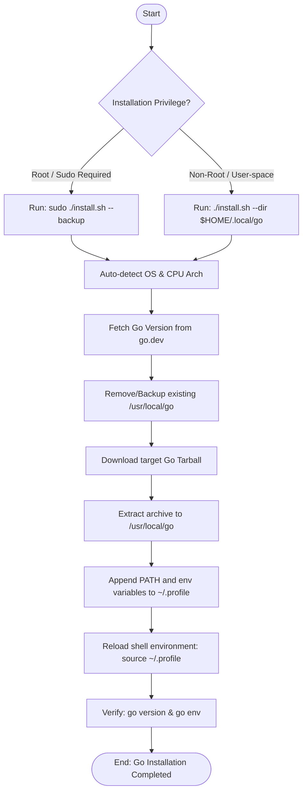

# Golang Installation Guide Documentation

---

# Document Information

| **Author** | **Created On** | **Version** | **L0 Reviewer**           | **L1 Reviewer**             | **L2 Reviewer**             |
| ---------------- | -------------------- | ----------------- | ------------------------------- | --------------------------------- | --------------------------------- |
| Amrendra         | 31-08-2026           | 1.0               | Shubham Rathi<L0 Reviewer></l0> | Shreya J/Nikita<L1 Reviewer></l1> | Piyush Upadhyay<L2 Reviewer></l2> |

---

# Table of Contents

1. [Introduction](#1-introduction)
2. [What is Golang](#2-what-is-golang)
3. [What is Golang Installation](#3-what-is-golang-installation)
4. [Why Golang Installation is Required](#4-why-golang-installation-is-required)
5. [Golang Installation Guide Workflow](#5-golang-installation-guide-workflow)
   - [5.1 Workflow Diagram](#51-workflow-diagram)
6. [Different Tools for Golang Installation](#6-different-tools-for-golang-installation)
7. [Best Practices](#7-best-practices)
8. [Recommendation / Conclusion](#8-recommendation--conclusion)
9. [Contact Information](#9-contact-information)
10. [References](#10-references)

---

# 1. Introduction

This document serves as a step-by-step setup guide for installing and configuring Go (Golang) on Linux environments. It focuses exclusively on using the automated `install.sh` Bash installation script to manage new installs, upgrade existing setups, and configure necessary environment paths.

---

# 2. What is Golang

Go, also known as Golang, is an open-source, compiled, and statically typed programming language developed by Google. Designed for simplicity, reliability, and concurrency, it is heavily used in cloud services, microservices, DevOps utilities, and systems programming. This guide supports configuring any recent version of Go (such as 1.21.x or 1.22.x LTS).

---

# 3. What is Golang Installation

Golang installation is the process of setting up the Go compiler, tools, and runtime environment. Before installing Go, make sure you have:

* A computer running Linux (e.g., Ubuntu/Debian or RedHat/CentOS).
* Sudo/Administrator access (for default global path setups).
* An active internet connection.
* Sufficient disk space (typically 500MB+).

### GOROOT vs GOPATH vs GOBIN

| Component        | Description                                                                                     |
| ---------------- | ----------------------------------------------------------------------------------------------- |
| **GOROOT** | The folder where the Go SDK and its libraries are installed (e.g.,`/usr/local/go`).           |
| **GOPATH** | The workspace directory where Go projects, source code, and binaries reside (default:`~/go`). |
| **GOBIN**  | The folder where Go CLI tools and installed binaries are placed (default:`$GOPATH/bin`).      |

---

# 4. Why Golang Installation is Required

Configuring the Go environment is essential for several reasons:

- **Compilation Capabilities:** The Go toolchain provides compiler tools (`go build`, `go install`) to package human-readable Go code into native executable binaries.
- **Dependency Management:** The package manager (`go mod`) requires a properly configured workspace to fetch, cache, and resolve external package imports.
- **Tool Integration:** Modern development editors (such as VS Code or GoLand) and CI/CD runners rely on correctly configured `GOROOT` and `GOPATH` environment variables to offer autocomplete, debugging, and linting.

---

# 5. Golang Installation Guide Workflow

The installation workflow focuses on using the automated Bash installer script which streamlines the setup process:

1. **System Detection:** Auto-detects target OS type and CPU architecture.
2. **Version Selection:** Querying the latest stable version from `go.dev` or accepting a specific user-defined version parameter.
3. **Upgrade Safety:** Backs up or cleans up existing installations to prevent mixed-dependency pollution.
4. **Execution:** Downloads, extracts the archive, and updates environment variables in shell profiles.
5. **Verification:** Validates installation paths and version execution.

## 5.1 Workflow Diagram



---

# 6. Different Tools for Golang Installation

| **Tool Option / Method**            | **Description**                                                                                |
| ----------------------------------------- | ---------------------------------------------------------------------------------------------------- |
| **`install.sh` Standard Install** | Installs the latest stable Go release globally to`/usr/local/go` (requires sudo).                  |
| **`install.sh` Custom Version**   | Downloads and configures a specific release version (e.g.,`1.21.3`) instead of the latest release. |
| **`install.sh` Custom Directory** | Installs Go locally into user-writable directories (e.g.,`$HOME/.local/go`) without root access.   |

---

# 7. Best Practices

Here are step-by-step procedures, validation methods, troubleshooting guides, and useful command references for setting up Go using the installer script.

### 7.1 Detailed Global Setup & Verification (Default Installation)

1. **Run Installer:**
   * Download the `install.sh` script to your machine and make it executable:
     ```bash
     chmod +x install.sh
     ```
   * Execute the installer script with sudo privileges (using the `--backup` option to secure older setups):
     ```bash
     sudo ./install.sh --backup
     ```
2. **Verification:**
   * Reload environment settings:
     ```bash
     source ~/.profile
     ```
   * Run `go version` (Expected output: `go version go1.x.x`).
   * Run `go env` to verify all environment variables (`GOROOT`, `GOPATH`).

### 7.2 Detailed Local Setup & Verification (User-space Installation)

1. **Run Installer for User-space:**
   * If you do not have root privileges, run the script specifying a user-writable directory path:
     ```bash
     ./install.sh --dir "$HOME/.local/go"
     ```
2. **Verification:**
   * Reload environment settings:
     ```bash
     source ~/.profile
     ```
   * Run `go version` (Expected output: `go version go1.x.x`).
   * Run `go env` to verify environment variables point to the custom local directory.

### 7.3 Troubleshooting Guidelines

> [!WARNING]
> **Problem 1: 'go' is not recognized / Command not found**
>
> * *Cause:* The directory `/usr/local/go/bin` is not present in your system `PATH` variable, or your active shell terminal has not reloaded the profile configurations.
> * *Solution:* Run `source ~/.profile` to reload variables, or check the terminal profile configurations to ensure the binary path was appended correctly.

> [!IMPORTANT]
> **Problem 2: Permission Denied during installation**
>
> * *Cause:* Trying to write or install to `/usr/local` or `/opt` directories without admin/sudo privileges.
> * *Solution:* Prefix the installer command with `sudo` or configure the installer to output to a user-owned path using the `-d` / `--dir` option.

> [!NOTE]
> **Problem 3: Version Unavailable / HTTP 404 Error**
>
> * *Cause:* Specifying an invalid or non-existent Go version parameter (e.g., `-v 1.99.9`).
> * *Solution:* Verify available versions on the [official download page](https://go.dev/dl/) and run the script with a correct version parameter.

### 7.4 Useful Commands Reference

| Purpose                              | Linux Command          | Description                                               |
| ------------------------------------ | ---------------------- | --------------------------------------------------------- |
| **Check Go version**           | `go version`         | Displays the installed Go compilation runtime version.    |
| **Print Go environments**      | `go env`             | Prints Go environment variables (`GOROOT`, `GOPATH`). |
| **Compile and run file**       | `go run main.go`     | Compiles and runs a Go program directly in one step.      |
| **Build Go executable**        | `go build`           | Compiles packages and dependencies into an executable.    |
| **Download & install modules** | `go install`         | Compiles and installs packages to`$GOPATH/bin`.         |
| **Initialize new module**      | `go mod init <name>` | Creates a new`go.mod` module file in the directory.     |
| **Format source code**         | `go fmt`             | Formats package sources according to Go code guidelines.  |

---

# 8. Recommendation / Conclusion

A successful installation is complete when `go version` outputs the correct version and paths are configured in your profile. For standard deployments, it is highly recommended to use the **automated `install.sh` script** with the `--backup` option. This keeps the environment clean by avoiding conflict bugs from mixed files of older releases, manages architecture variations natively, and configures standard environment variables automatically.

---

# 9. Contact Information

| **Name** | **Email**                                                                      |
| -------------- | ------------------------------------------------------------------------------------ |
| Amrendra       | [amrendra.yadav.snaatak@mygurukulam.co](mailto:amrendra.yadav.snaatak@mygurukulam.co) |

---

# 10. References

| **Topic**                                         | **Description**                                         |
| ------------------------------------------------------- | ------------------------------------------------------------- |
| [Official Go Website](https://go.dev/)                   | The home page for Go documentation and downloads.             |
| [Go Downloads Page](https://go.dev/dl/)                  | Official source downloads and standard installation packages. |
| [Go Installation Guidelines](https://go.dev/doc/install) | Official step-by-step setup guides for all OS variants.       |
