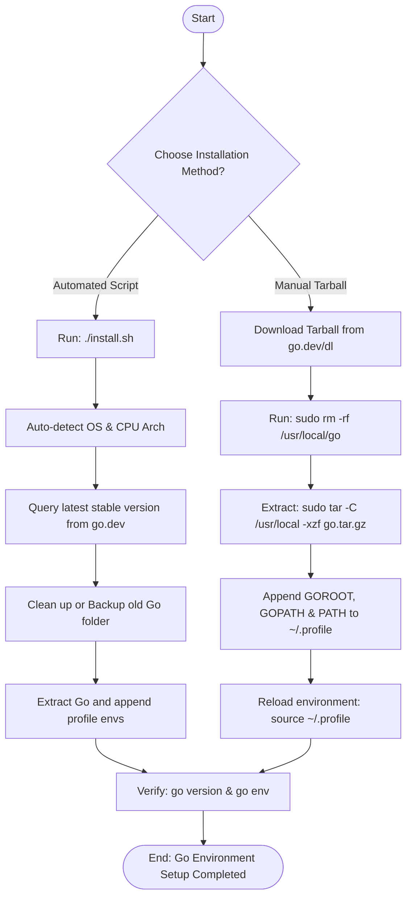

# Golang Installation Guide Documentation

---

# Document Information

| **Author** | **Created On** | **Version** | **L0 Reviewer**           | **L1 Reviewer**             | **L2 Reviewer**             |
| ---------------- | -------------------- | ----------------- | ------------------------------- | --------------------------------- | --------------------------------- |
| Amrendra         | 30-08-2026           | 1.0               | Shubham Rathi<L0 Reviewer></l0> | Shreya J/Nikita<L1 Reviewer></l1> | Piyush Upadhyay<L2 Reviewer></l2> |

---

# Table of Contents

1. [Introduction](#1-introduction)
2. [What is Golang](#2-what-is-golang)
3. [What is Golang Installation](#3-what-is-golang-installation)
4. [Why Golang Installation is Required](#4-why-golang-installation-is-required)
5. [Golang Installation Guide Workflow](#5-golang-installation-guide-workflow)
   - [5.1 Workflow Diagram](#51-workflow-diagram)
6. [Different Tools for Golang Installation](#6-different-tools-for-golang-installation)
7. [Best Practices](#7-best-practices)
8. [Recommendation / Conclusion](#8-recommendation--conclusion)
9. [Contact Information](#9-contact-information)
10. [References](#10-references)

---

# 1. Introduction

This document serves as a step-by-step setup guide for installing and configuring Go (Golang) on Windows, Linux, and macOS systems. It provides standard procedures to install Golang, configure system environment variables, verify installations, and troubleshoot common setup issues using both manual methods and an automated installer script.

---

# 2. What is Golang

Go, also known as Golang, is an open-source, compiled, and statically typed programming language developed by Google. Designed for simplicity, reliability, and concurrency, it is heavily used in cloud services, microservices, DevOps utilities, and systems programming. This guide supports configuring any recent version of Go (such as 1.21.x or 1.22.x LTS).

---

# 3. What is Golang Installation

Golang installation is the process of setting up the Go compiler, tools, and runtime environment. Before installing Go, make sure you have:

* A computer running Linux, macOS, or Windows.
* Administrator/sudo access (for default global path setups).
* An active internet connection.
* Sufficient disk space (typically 500MB+).

### GOROOT vs GOPATH vs GOBIN

| Component        | Description                                                                                     |
| ---------------- | ----------------------------------------------------------------------------------------------- |
| **GOROOT** | The folder where the Go SDK and its libraries are installed (e.g.,`/usr/local/go`).           |
| **GOPATH** | The workspace directory where Go projects, source code, and binaries reside (default:`~/go`). |
| **GOBIN**  | The folder where Go CLI tools and installed binaries are placed (default:`$GOPATH/bin`).      |

---

# 4. Why Golang Installation is Required

Configuring the Go environment is essential for several reasons:

- **Compilation Capabilities:** The Go toolchain provides compiler tools (`go build`, `go install`) to package human-readable Go code into native executable binaries.
- **Dependency Management:** The package manager (`go mod`) requires a properly configured workspace to fetch, cache, and resolve external package imports.
- **Tool Integration:** Modern development editors (such as VS Code or GoLand) and CI/CD runners rely on correctly configured `GOROOT` and `GOPATH` environment variables to offer autocomplete, debugging, and linting.

---

# 5. Golang Installation Guide Workflow

The installation workflow varies depending on whether you are using the automated Bash installer script or native tools.

### Automated Script Workflow:

1. **System Detection:** Auto-detects target OS type and CPU architecture.
2. **Version Selection:** Fetches the latest stable version from official servers or accepts a specific parameter.
3. **Upgrade Safety:** Backs up or cleans up existing installations to prevent folder pollution.
4. **Execution:** Downloads, extracts the archive, and updates environment variables in shell profiles.

### Manual Tarball Workflow (Linux/macOS):

1. **Download:** Download the target `.tar.gz` package from `go.dev/dl/`.
2. **Extract:** Remove any old installation and extract to `/usr/local/go`.
3. **Environment Setup:** Append environmental paths (`PATH`, `GOPATH`, `GOBIN`) to user profile files.
4. **Verification:** Validate the paths and execution outputs.

## 5.1 Workflow Diagram



---

# 6. Different Tools for Golang Installation

| **Tool**                       | **Description**                                                                                              |
| ------------------------------------ | ------------------------------------------------------------------------------------------------------------------ |
| **`install.sh` Bash Script** | Standardized custom installer script resolving dependencies, clean upgrades, and automatic profiles configuration. |
| **APT Package Manager**        | Debian/Ubuntu command-line system package manager. Convenient but often includes older Go package versions.        |
| **Manual Tarball Extraction**  | Direct download and manual extraction of official packages, giving maximum flexibility on directory locations.     |

---

# 7. Best Practices

Here are step-by-step procedures, validation methods, troubleshooting guides, and useful command references for setting up Go.

### 7.1 Detailed Automated Script Setup & Verification

1. **Run Installer:**
   * Download the `install.sh` script to your machine and make it executable:
     ```bash
     chmod +x install.sh
     ```
   * Execute the installer script (use `sudo` if installing to the default location `/usr/local/go`):
     ```bash
     sudo ./install.sh --backup
     ```
2. **Local User Installation (Non-Root/No-Sudo):**
   * If you do not have root privileges, run the script specifying a user-writable directory path:
     ```bash
     ./install.sh --dir "$HOME/.local/go"
     ```
3. **Verification:**
   * Reload environment settings: `source ~/.profile` (or `source ~/.bashrc` / `source ~/.zshrc`).
   * Run `go version` (Expected output: `go version go1.21.x` or similar).
   * Run `go env` to verify all environment variables (`GOROOT`, `GOPATH`).

### 7.2 Detailed Linux Manual Setup & Verification

1. **Download & Clean:**
   * Download the latest package: `curl -OL https://go.dev/dl/go1.21.3.linux-amd64.tar.gz`.
   * Safely remove any previous installation: `sudo rm -rf /usr/local/go`.
2. **Extract Package:**
   * Extract the downloaded archive to `/usr/local`:
     ```bash
     sudo tar -C /usr/local -xzf go1.21.3.linux-amd64.tar.gz
     ```
3. **Configure Environment Variables:**
   * Open `~/.profile` or `~/.bashrc` and append:
     ```bash
     export GOROOT=/usr/local/go
     export GOPATH=$HOME/go
     export PATH=$PATH:$GOROOT/bin:$GOPATH/bin
     ```
   * Reload variables: `source ~/.profile`.

### 7.3 Troubleshooting Guidelines

> [!WARNING]
> **Problem 1: 'go' is not recognized / Command not found**
>
> * *Cause:* The directory `/usr/local/go/bin` is not present in your system `PATH` variable, or your active shell terminal has not reloaded the profile configurations.
> * *Solution:* Append the bin directory to your `PATH` and run `source ~/.profile` or restart your terminal.

> [!IMPORTANT]
> **Problem 2: Permission Denied during installation**
>
> * *Cause:* Trying to write or install to `/usr/local` or `/opt` directories without admin/sudo privileges.
> * *Solution:* Prefix the installer command with `sudo` or configure the installer to output to a user-owned path (e.g., `-d ~/.local/go`).

> [!NOTE]
> **Problem 3: Duplicate Go path entries or conflicting versions**
>
> * *Solution:* Inspect your shell configurations (`~/.bashrc`, `~/.profile`, `~/.zshrc`) and remove overlapping path modifications. Use `which go` to identify which executable is being called first.

### 7.4 Useful Commands Reference

| Purpose                              | Linux / macOS Command  | Description                                               |
| ------------------------------------ | ---------------------- | --------------------------------------------------------- |
| **Check Go version**           | `go version`         | Displays the installed Go compilation runtime version.    |
| **Print Go environments**      | `go env`             | Prints Go environment variables (`GOROOT`, `GOPATH`). |
| **Compile and run file**       | `go run main.go`     | Compiles and runs a Go program directly in one step.      |
| **Build Go executable**        | `go build`           | Compiles packages and dependencies into an executable.    |
| **Download & install modules** | `go install`         | Compiles and installs packages to`$GOPATH/bin`.         |
| **Initialize new module**      | `go mod init <name>` | Creates a new`go.mod` module file in the directory.     |
| **Format source code**         | `go fmt`             | Formats package sources according to Go code guidelines.  |

---

# 8. Recommendation / Conclusion

A successful installation is complete when `go version` outputs the correct version and paths are configured in your profile. For standard deployments, it is highly recommended to use the **automated `install.sh` script** with the `--backup` option. This keeps the environment clean by avoiding conflict bugs from mixed files of older releases, manages architecture variations natively, and configures standard environment variables automatically.

---

# 9. Contact Information

| **Name** | **Email**                                                                      |
| -------------- | ------------------------------------------------------------------------------------ |
| Amrendra       | [amrendra.yadav.snaatak@mygurukulam.co](mailto:amrendra.yadav.snaatak@mygurukulam.co) |

---

# 10. References

| **Topic**                                         | **Description**                                         |
| ------------------------------------------------------- | ------------------------------------------------------------- |
| [Official Go Website](https://go.dev/)                   | The home page for Go documentation and downloads.             |
| [Go Downloads Page](https://go.dev/dl/)                  | Official source downloads and standard installation packages. |
| [Go Installation Guidelines](https://go.dev/doc/install) | Official step-by-step setup guides for all OS variants.       |
