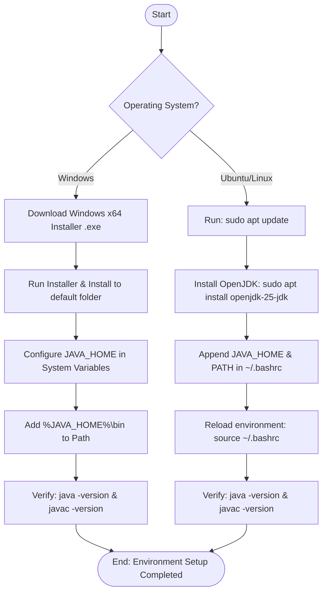

# Java  Installation Guide Documentation

# Document Information

| **Author** | **Created On** | **Version** | **L0 Reviewer**           | **L1 Reviewer**             | **L2 Reviewer**             |
| ---------------- | -------------------- | ----------------- | ------------------------------- | --------------------------------- | --------------------------------- |
| Amrendra         | 25-08-2026           | 1.0               | Shubham Rathi<L0 Reviewer></l0> | Shreya J/Nikita<L1 Reviewer></l1> | Piyush Upadhyay<L2 Reviewer></l2> |

---

# Table of Contents

1. [Introduction](#1-introduction)
2. [What is Java Installation](#2-what-is-java-installation)
3. [Prerequisites](#3-prerequisites)
4. [Java Installation Guide Workflow](#4-java-installation-guide-workflow)
   - [4.1 Workflow Diagram](#41-workflow-diagram)
   - [4.2 Detailed Windows Setup & Verification](#42-detailed-windows-setup--verification)
   - [4.3 Detailed Ubuntu/Linux Setup & Verification](#43-detailed-ubuntulinux-setup--verification)
5. [Different Tools for Java Installation](#5-different-tools-for-java-installation)
6. [Recommendation / Conclusion](#6-recommendation--conclusion)
7. [Contact Information](#7-contact-information)
8. [References](#8-references)

---

# 1. Introduction

This document serves as a step-by-step setup guide for installing and configuring the Java Development Kit (JDK) on Windows and Ubuntu/Linux systems. It provides standard procedures to install JDK 25 (LTS version 25.0.4.1), configure environment variables, and verify installations.

---

# 2. What is Java Installation

Java installation is the process of setting up the Java runtime environment and development tools on Windows or Ubuntu/Linux systems.

### JDK vs JRE vs JVM

| Component     | Description                                                                       |
| ------------- | --------------------------------------------------------------------------------- |
| **JDK** | Java Development Kit. Used to develop, compile, debug, and run Java applications. |
| **JRE** | Java Runtime Environment. Used to run Java applications.                          |
| **JVM** | Java Virtual Machine. Executes Java bytecode.                                     |

---

# 3. Prerequisites

| **Prerequisite** | **Requirement / Specification** |
| :--- | :--- |
| **Operating System** | Computer running Windows or Linux |
| **System Privileges** | Administrator access (Windows) or `sudo` privileges (Linux) |
| **Network** | Active internet connection to download JDK packages |
| **Disk Space** | Sufficient storage space for the JDK installation |

---

# 4. Java Installation Guide Workflow

The installation workflow outlines the end-to-end setup procedure for both Windows and Linux platforms.

## 4.1 Workflow Diagram

### 4.2 Detailed Windows Setup & Verification

| **Step** | **Task** | **Instructions** | **Commands** |
| :---: | :--- | :--- | :--- |
| **1** | **Download & Install** | Download the Windows x64 Installer (.exe) from Oracle and install using default path (`C:\Program Files\Java\`). | — |
| **2** | **Set `JAVA_HOME`** | Open System Properties > Advanced > Environment Variables. Add `JAVA_HOME` under System variables. | `sysdm.cpl` Name: `JAVA_HOME` Value: `C:\Program Files\Java\jdk-25` |
| **3** | **Update `PATH`** | Edit `Path` under System variables and append the JDK `bin` folder. | `%JAVA_HOME%\bin` |
| **4** | **Verification** | Open a new Command Prompt and verify runtime, compiler, paths, and environment variable. | `java -version` `javac -version` `where java` `where javac` `echo %JAVA_HOME%` |

### 4.3 Detailed Ubuntu/Linux Setup & Verification

| **Step** | **Task** | **Instructions** | **Commands** |
| :---: | :--- | :--- | :--- |
| **1** | **Install OpenJDK** | Update package cache and install OpenJDK 25. | `sudo apt update` `sudo apt install -y openjdk-25-jdk` |
| **2** | **Determine Install Path** | Locate the absolute path of the Java binary. | `readlink -f $(which java)` |
| **3** | **Configure `JAVA_HOME` & `PATH`** | Append environment variables to `~/.bashrc` and reload the shell profile. | `export JAVA_HOME=/usr/lib/jvm/java-25-openjdk-amd64` `export PATH=$JAVA_HOME/bin:$PATH` `source ~/.bashrc` |
| **4** | **Verification** | Open a terminal and verify runtime, compiler, paths, and environment variable. | `java -version` `javac -version` `which java` `which javac` `echo $JAVA_HOME` |
| **5** | **Manage Versions** | (Optional) View installed versions and select the active runtime or compiler if multiple JDKs exist. | `update-java-alternatives --list` `sudo update-alternatives --config java` `sudo update-alternatives --config javac` |

---

# 5. Different Tools for Java Installation

| **Tool**                      | **Description**                                                                                   |
| ----------------------------------- | ------------------------------------------------------------------------------------------------------- |
| **Oracle Installer (.exe)**   | The official executable installer package distributed by Oracle for Windows systems.                    |
| **APT Package Manager**       | Command-line utility on Ubuntu/Debian used to install OpenJDK packages from official repositories.      |
| **Manual Tarball Extraction** | Extracting archive formats directly to a chosen location and manual management of runtime environments. |

---

# 6. Recommendation / Conclusion

Java installation is complete when `java -version` and `javac -version` execute successfully on the terminal. For standard environments, deploying **OpenJDK 25 (LTS)** (specifically version **25.0.4.1**) using package managers (APT on Ubuntu) or standard setup binaries (on Windows) is recommended. Setting the system environment variable `JAVA_HOME` and updating `PATH` completes the configuration, leaving the system fully ready for Java application development.

---

# 7. Contact Information

| **Name** | **Email**                                                                      |
| -------------- | ------------------------------------------------------------------------------------ |
| Amrendra       | [amrendra.yadav.snaatak@mygurukulam.co](mailto:amrendra.yadav.snaatak@mygurukulam.co) |

---

# 8. References

| **Topic**                                                                                              | **Description**                                       |
| ------------------------------------------------------------------------------------------------------------ | ----------------------------------------------------------- |
| [Oracle Java Technologies](https://www.oracle.com/in/java/technologies/?utm_source=chatgpt.com)               | Home page for Java developer tools.                         |
| [Oracle JDK 25 Installation Guide](https://docs.oracle.com/en/java/javase/25/install/?utm_source=chatgpt.com) | Step-by-step setup guides for JDK 25.                       |
| [Oracle JDK 25 Documentation](https://docs.oracle.com/en/java/javase/25/?utm_source=chatgpt.com)              | Official JDK 25 releases, specs, and modules documentation. |
