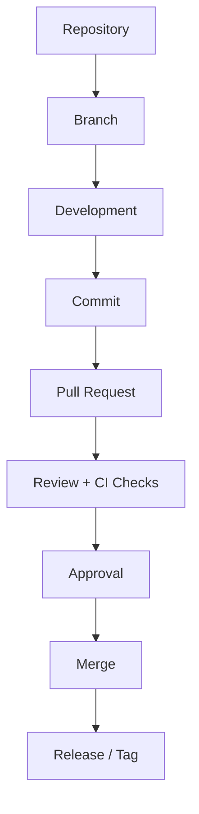

# Microrepo Documentation

---

## Document Information

| Author   | Created On | Version | L0 Reviewer   | L1 Reviewer       | L2 Reviewer     |
| :------- | :--------- | :------ | :------------ | :---------------- | :-------------- |
| Amrendra | 11-09-2026 | 1.1   | Shubham Rathi | Shreya J / Nikita | Piyush Upadhyay |

---

# Table of Contents

1. [Purpose](#1-purpose)
2. [What is Microrepo](#2-what-is-microrepo)
3. [Why Microrepo](#3-why-microrepo)
4. [Microrepo Features](#4-microrepo-features)
5. [Advantages and Disadvantages](#5-advantages-and-disadvantages)
6. [Microrepo Workflow](#6-microrepo-workflow)
7. [Best Practices for Microrepo Management](#7-best-practices-for-microrepo-management)
8. [Conclusion](#8-conclusion)
9. [Contact Information](#9-contact-information)
10. [References](#10-references)

---

# 1. Purpose

The purpose of this document is to explain Microrepo architecture in simple terms.
It guides teams on how to manage and organize separate repositories independently.

---

# 2. What is Microrepo

A Microrepo is an approach where each project or service has its own separate Git repository.
Each repository has its own code, commit history, and release tags, keeping teams independent.

---

# 3. Why Microrepo

| Need / Factor                | Why Microrepo Solves It                                         |
| :--------------------------- | :-------------------------------------------------------------- |
| **Team Independence**  | Teams work on their own code without waiting for others.        |
| **Separate Releases**  | Release updates for one project without touching other repos.   |
| **Access Control**     | Give developers access only to the repositories they need.      |
| **Fast Git Speed**     | Small repositories make cloning and pulling code very fast.     |
| **Simple Maintenance** | Repositories have simple commit history and are easy to manage. |

---

# 4. Microrepo Features

| Feature                         | Description                                                     |
| :------------------------------ | :-------------------------------------------------------------- |
| **Separate Repositories** | Each app or service lives in its own Git repo.                  |
| **Independent Branching** | Teams create and manage branches without affecting other repos. |
| **Separate Versioning**   | Each repo has its own release tags and version numbers.         |
| **Custom Access Rights**  | Set read and write permissions per repository.                  |

---

# 5. Advantages and Disadvantages

| Category               | Advantages                                            | Disadvantages                                               |
| :--------------------- | :---------------------------------------------------- | :---------------------------------------------------------- |
| **Releases**     | Teams can tag and release code on their own schedule. | Hard to make changes across multiple repositories at once.  |
| **Security**     | Easy to restrict access to sensitive repositories.    | Difficult to manage settings across many repos.             |
| **Speed**        | Small repos clone and download quickly.               | Hard to find and reuse code stored in other repos.          |
| **Management**   | Simple Git history and clean repository branches.     | Must configure branch rules and permissions for every repo. |
| **Dependencies** | Update dependencies whenever the team wants.          | Libraries can easily get out of sync across repos.          |

---

# 6. Microrepo Workflow

### Workflow Diagram

### Workflow Steps

| Step        | Phase                        | Description                                        |
| :---------- | :--------------------------- | :------------------------------------------------- |
| **1** | **Repository**         | Select and clone the specific service repository.  |
| **2** | **Branch**             | Create a local working branch for the task.        |
| **3** | **Development**        | Write code and test changes locally.               |
| **4** | **Commit**             | Save changes with clear commit messages.           |
| **5** | **Pull Request**       | Push the branch and open a PR for review.          |
| **6** | **Review + CI Checks** | Peers review code while automated tests verify it. |
| **7** | **Approval**           | Repository maintainers approve the pull request.   |
| **8** | **Merge**              | Merge approved code into the`main` branch.       |
| **9** | **Release / Tag**      | Create a version tag to mark the release.          |

---

# 7. Best Practices for Microrepo Management

| Best Practice                    | Description                                                          |
| :------------------------------- | :------------------------------------------------------------------- |
| **Use Standard Templates** | Keep repository structure and README consistent across all projects. |
| **Protect Main Branch**    | Require code review and approval before merging pull requests.       |
| **Use Version Tags**       | Tag each release clearly (e.g.,`v1.0.0`) in the repository.        |
| **Update Dependencies**    | Regularly update project libraries to avoid security issues.         |

---

# 8. Conclusion

A Microrepo architecture gives teams full independence and allows fast, separate repository management.
With standard templates and automated updates, teams can easily maintain multiple repositories.

---

# 9. Contact Information

| Name     | Email                                 |
| :------- | :------------------------------------ |
| Amrendra | amrendra.yadav.snaatak@mygurukulam.co |

---

# 10. References

| Resource                            | Link                                                 |
| :---------------------------------- | :--------------------------------------------------- |
| Martin Fowler - Microservices Guide | https://martinfowler.com/articles/microservices.html |
| Git Multi-Repository Patterns       | https://git-scm.com/book/en/v2                       |
| Semantic Versioning Specification   | https://semver.org/                                  |

---
