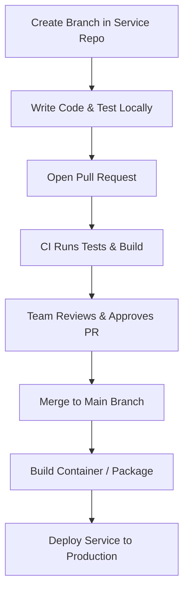

# Micro repo Features Documentation

---

## Document Information

| Author   | Created On | Version | L0 Reviewer   | L1 Reviewer       | L2 Reviewer        |
| :------- | :--------- | :------ | :------------ | :---------------- | :----------------- |
| Amrendra | 11-09-2026 | 1.0     | Shubham Rathi | Shreya J / Nikita | Piyush Upadhyay    |

---

# Table of Contents

1. [Purpose](#1-purpose)
2. [What is Microrepo](#2-what-is-microrepo)
3. [Why Microrepo](#3-why-microrepo)
4. [Microrepo Features](#4-microrepo-features)
5. [Advantages and Disadvantages](#5-advantages-and-disadvantages)
6. [Microrepo Workflow](#6-microrepo-workflow)
7. [Best Practices for Microrepo Management](#7-best-practices-for-microrepo-management)
8. [Conclusion](#8-conclusion)
9. [Contact Information](#9-contact-information)
10. [References](#10-references)

---

# 1. Purpose

The purpose of this document is to explain Microrepo architecture in simple terms.
It guides teams on how to manage separate repositories and deploy services independently.

---

# 2. What is Microrepo

A Microrepo is an approach where each project or service has its own separate Git repository.
Each repository has its own code, commit history, and deployment pipeline, keeping teams independent.

---

# 3. Why Microrepo

| Need / Factor | Why Microrepo Solves It |
| :------------ | :---------------------- |
| **Team Independence** | Teams work on their own code without waiting for others. |
| **Separate Deployments** | Deploy one service without affecting other services. |
| **Access Control** | Give developers access only to the repositories they need. |
| **Fast Git Speed** | Small repositories make cloning and pulling code very fast. |
| **Simple CI/CD** | Pipelines are small, fast, and test only one service. |

---

# 4. Microrepo Features

| Feature | Description |
| :------ | :---------- |
| **Separate Repositories** | Each app or service lives in its own Git repo. |
| **Independent CI/CD** | Builds and deploys run only for that specific repo. |
| **Separate Versioning** | Each repo has its own release tags and version numbers. |
| **Package Registries** | Shared libraries are published to npm, PyPI, or Docker Hub. |
| **Custom Access Rights** | Set read and write permissions per repository. |
| **Tech Stack Choice** | Teams can pick the best programming language for their service. |

---

# 5. Advantages and Disadvantages

| Category | Advantages | Disadvantages |
| :------- | :--------- | :------------ |
| **Releases** | Fast and independent releases for each service. | Hard to make changes across multiple repositories at once. |
| **Security** | Easy to restrict access to sensitive repositories. | Difficult to manage security settings across many repos. |
| **Speed** | Small repos clone and download quickly. | Hard to find and reuse code stored in other repos. |
| **CI/CD** | Simple pipelines that test only one project. | Must set up and maintain a pipeline for every repo. |
| **Dependencies** | Update dependencies whenever the team wants. | Libraries can easily get out of sync across repos. |

---

# 6. Microrepo Workflow

### Workflow Diagram

### Workflow Steps

| Step | Action | Description |
| :--- | :----- | :---------- |
| **1** | **Branch** | Create a new branch in the service repository. |
| **2** | **Develop** | Write code and test the service locally. |
| **3** | **Pull Request** | Open a PR for review. |
| **4** | **CI Check** | The pipeline runs tests and checks for errors. |
| **5** | **Review & Merge** | Team reviews and merges code into `main`. |
| **6** | **Deploy** | Build the package and deploy the service. |

---

# 7. Best Practices for Microrepo Management

| Best Practice | Description |
| :------------ | :---------- |
| **Automate Updates** | Use tools like Dependabot to keep libraries updated automatically. |
| **Use Repo Templates** | Create standard templates so all new repositories look the same. |
| **Follow SemVer** | Use clear version numbers (`1.0.0`) for every release. |
| **Share CI Templates** | Reuse standard CI pipeline configs across all repositories. |
| **Use Package Registries** | Share common code through private package registries. |
| **Clear API Contracts** | Define clear API schemas so services do not break each other. |

---

# 8. Conclusion

A Microrepo architecture gives teams full independence and allows fast, separate deployments.
With standard templates and automated updates, teams can easily manage multiple repositories.

---

# 9. Contact Information

| Name | Email |
| :--- | :---- |
| Amrendra | amrendra.yadav.snaatak@mygurukulam.co |

---

# 10. References

| Resource | Link |
| :------- | :--- |
| Martin Fowler - Microservices Guide | https://martinfowler.com/articles/microservices.html |
| Git Multi-Repository Patterns | https://git-scm.com/book/en/v2 |
| Semantic Versioning Specification | https://semver.org/ |

---
