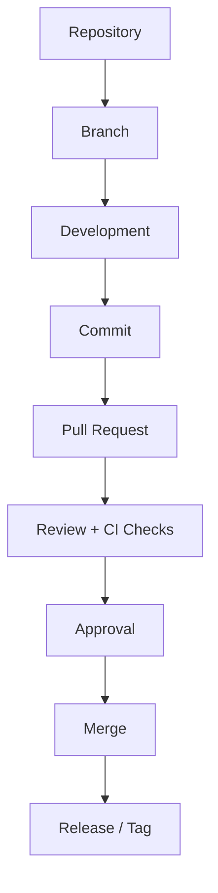

# Monorepo Documentation

---

## Document Information

| Author   | Created On | Version | L0 Reviewer   | L1 Reviewer       | L2 Reviewer     |
| :------- | :--------- | :------ | :------------ | :---------------- | :-------------- |
| Amrendra | 11-09-2026 | 1.1     | Shubham Rathi | Shreya J / Nikita | Piyush Upadhyay |

---

# Table of Contents

1. [Purpose](#1-purpose)
2. [What is Monorepo](#2-what-is-monorepo)
3. [Why Monorepo](#3-why-monorepo)
4. [Monorepo Features](#4-monorepo-features)
5. [Advantages and Disadvantages](#5-advantages-and-disadvantages)
6. [Monorepo Workflow](#6-monorepo-workflow)
7. [Best Practices for Monorepo Management](#7-best-practices-for-monorepo-management)
8. [Conclusion](#8-conclusion)
9. [Contact Information](#9-contact-information)
10. [References](#10-references)

---

# 1. Purpose

The purpose of this document is to provide a clear and simple guide to understanding Monorepo architecture.
It helps developers and teams understand how to store, share, and manage multiple projects in a single codebase efficiently.

---

# 2. What is Monorepo

A Monorepo is a single Git repository where code for multiple projects, applications, and shared libraries is stored together.
Instead of creating a separate repository for every project, teams use one common codebase while still keeping projects modular and independent.

---

# 3. Why Monorepo

| Challenge in Multi-Repo          | Why Monorepo Solves It                                                                          |
| :------------------------------- | :---------------------------------------------------------------------------------------------- |
| **Dependency Drift**       | Keeps shared packages and libraries synchronized across all projects using a single lockfile.   |
| **Complex Cross-Repo PRs** | Allows updating shared libraries and consuming applications together in a single atomic commit. |
| **Code Duplication**       | Enables instant code sharing without having to publish packages to external registries.         |
| **Tooling Fragmentation**  | Provides a single unified setup for linting, testing, formatting, and CI/CD pipelines.          |
| **Difficult Onboarding**   | Developers clone one repository and run a single command to set up the entire ecosystem.        |

---

# 4. Monorepo Features

| Feature                       | Description                                                           |
| :---------------------------- | :-------------------------------------------------------------------- |
| **Single Repository**   | All projects, apps, and shared libraries live in one Git repo.        |
| **Direct Code Sharing** | Projects can use shared code directly without publishing packages.    |
| **Atomic Commits**      | Update multiple projects or packages together in a single commit.     |
| **Unified Lockfile**    | One lockfile keeps library versions the same across all projects.     |
| **Code Ownership**      | Assign team review approvals to specific folders using`CODEOWNERS`. |

---

# 5. Advantages and Disadvantages

| Category               | Advantages                                                  | Disadvantages                                           |
| :--------------------- | :---------------------------------------------------------- | :------------------------------------------------------ |
| **Code Sharing** | Easy to reuse code across apps without publishing packages. | Need clear rules to avoid tightly coupled code.         |
| **Refactoring**  | Update shared code and apps in a single pull request.       | Breaking changes can impact multiple apps.              |
| **Dependencies** | Consistent library versions across the whole codebase.      | Large library updates require team coordination.        |
| **Speed**        | Shared build caching speeds up local and CI checks.         | Large repository size needs Git optimizations.          |
| **Visibility**   | Complete visibility across all projects and libraries.      | Requires strong code review policies to manage changes. |

---

# 6. Monorepo Workflow

### Workflow Diagram

### Workflow Steps

| Step        | Phase                        | Description                                         |
| :---------- | :--------------------------- | :-------------------------------------------------- |
| **1** | **Repository**         | Open or pull the single shared repository.          |
| **2** | **Branch**             | Create a local working branch for the task.         |
| **3** | **Development**        | Update apps or shared libraries in their folders.   |
| **4** | **Commit**             | Save atomic commits across changed projects.        |
| **5** | **Pull Request**       | Push the branch and open a PR for review.           |
| **6** | **Review + CI Checks** | Peers review code while CI tests affected projects. |
| **7** | **Approval**           | Folder owners approve the PR using`CODEOWNERS`.   |
| **8** | **Merge**              | Merge approved code into the`main` branch.        |
| **9** | **Release / Tag**      | Tag releases for updated projects or packages.      |

---

# 7. Best Practices for Monorepo Management

| Best Practice                      | Description                                                    |
| :--------------------------------- | :------------------------------------------------------------- |
| **Trunk-Based Development**  | Keep feature branches short and merge frequently into`main`. |
| **Use CODEOWNERS**           | Assign clear team ownership for specific project folders.      |
| **Test Affected Only**       | Run tests and checks only on projects changed in the PR.       |
| **Standardize Dependencies** | Use the same version for shared libraries across all projects. |

---

# 8. Conclusion

A Monorepo simplifies multi-project management by centralizing codebases, eliminating dependency drift, and enabling seamless code sharing.
When combined with build caching and affected-only workflows, it significantly boosts developer productivity while maintaining architectural consistency.

---

# 9. Contact Information

| Name     | Email                                 |
| :------- | :------------------------------------ |
| Amrendra | amrendra.yadav.snaatak@mygurukulam.co |

---

# 10. References

| Resource                | Link                          |
| :---------------------- | :---------------------------- |
| Monorepo Tools Guide    | https://monorepo.tools/       |
| Turborepo Documentation | https://turbo.build/repo/docs |
| Nx Documentation        | https://nx.dev/               |

---
