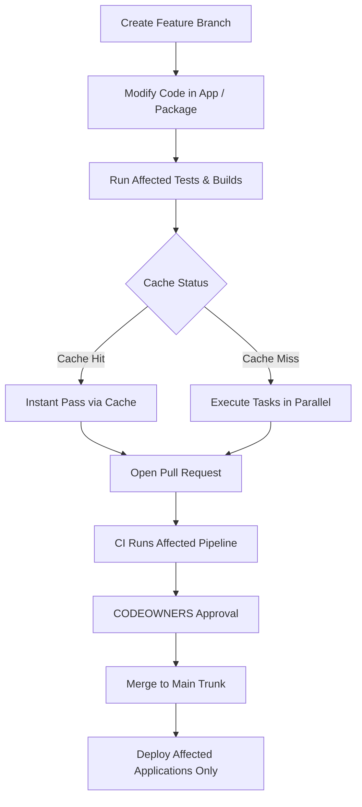

# Mono repo Features Documentation

---

## Document Information

| Author   | Created On | Version | L0 Reviewer   | L1 Reviewer       | L2 Reviewer        |
| :------- | :--------- | :------ | :------------ | :---------------- | :----------------- |
| Amrendra | 11-09-2026 | 1.0     | Shubham Rathi | Shreya J / Nikita | Piyush Upadhyay    |

---

# Table of Contents

1. [Purpose](#1-purpose)
2. [What is Monorepo](#2-what-is-monorepo)
3. [Why Monorepo](#3-why-monorepo)
4. [Monorepo Features](#4-monorepo-features)
5. [Advantages and Disadvantages](#5-advantages-and-disadvantages)
6. [Monorepo Workflow](#6-monorepo-workflow)
7. [Best Practices for Monorepo Management](#7-best-practices-for-monorepo-management)
8. [Conclusion](#8-conclusion)
9. [Contact Information](#9-contact-information)
10. [References](#10-references)

---

# 1. Purpose

The purpose of this document is to provide a clear and simple guide to understanding Monorepo architecture.
It helps developers and teams understand how to store, share, and manage multiple projects in a single codebase efficiently.

---

# 2. What is Monorepo

A Monorepo is a single Git repository where code for multiple projects, applications, and shared libraries is stored together.
Instead of creating a separate repository for every project, teams use one common codebase while still keeping projects modular and independent.

---

# 3. Why Monorepo

| Challenge in Multi-Repo | Why Monorepo Solves It |
| :---------------------- | :--------------------- |
| **Dependency Drift** | Keeps shared packages and libraries synchronized across all projects using a single lockfile. |
| **Complex Cross-Repo PRs** | Allows updating shared libraries and consuming applications together in a single atomic commit. |
| **Code Duplication** | Enables instant code sharing without having to publish packages to external registries. |
| **Tooling Fragmentation** | Provides a single unified setup for linting, testing, formatting, and CI/CD pipelines. |
| **Difficult Onboarding** | Developers clone one repository and run a single command to set up the entire ecosystem. |

---

# 4. Monorepo Features

| Feature | Description |
| :------ | :---------- |
| **Workspace Management** | Links local packages and dependencies directly without publishing to a remote registry. |
| **Computation Caching** | Caches previous build, test, and lint results to avoid rebuilding unchanged code. |
| **Affected Project Detection** | Analyzes Git commits to execute tasks only on modified code and dependent packages. |
| **Task Orchestration** | Runs tasks in parallel in the correct dependency order with maximum CPU utilization. |
| **Unified Lockfile** | Manages all third-party dependencies centrally to ensure consistent versions. |
| **Code Ownership** | Enforces directory-level approvals before changes can be merged using `CODEOWNERS`. |

---

# 5. Advantages and Disadvantages

| Category | Advantages | Disadvantages |
| :------- | :--------- | :------------ |
| **Code Sharing** | Easy reuse of shared components and utilities across all apps. | Requires clear boundaries to prevent unintended coupling. |
| **Refactoring** | Atomic updates across multiple projects in a single pull request. | Breaking changes can impact multiple apps if not tested well. |
| **Build & CI** | Fast execution through local and remote build caching. | Requires monorepo build tools like Turborepo or Nx. |
| **Dependencies** | Consistent versions across the entire codebase. | Coordinated upgrades needed for major third-party library updates. |
| **Repository Size** | Single source of truth and uniform developer onboarding. | Larger repository size requires Git optimizations like sparse-checkout. |

---

# 6. Monorepo Workflow

### Workflow Diagram

### Workflow Steps

| Step | Action | Description |
| :--- | :----- | :---------- |
| **1** | **Branch** | Create a short-lived feature branch from `main`. |
| **2** | **Develop** | Make changes to the desired application or shared package. |
| **3** | **Local Test** | Run affected commands (`nx affected` or `turbo run`) to test only modified code. |
| **4** | **Pull Request** | Open a PR; CI validates only affected projects using remote caching. |
| **5** | **Review & Merge** | Team leads approve changes based on `CODEOWNERS`, then code merges to `main`. |
| **6** | **Deploy** | Continuous Deployment triggers only for the affected applications. |

---

# 7. Best Practices for Monorepo Management

| Best Practice | Description |
| :------------ | :---------- |
| **Trunk-Based Development** | Keep feature branches short-lived (< 1–2 days) and merge frequently into `main`. |
| **Enable Remote Caching** | Share build and test caches across developers and CI to eliminate duplicate runs. |
| **Enforce Code Ownership** | Use `.github/CODEOWNERS` to ensure domain leads review relevant directories. |
| **Define Module Boundaries** | Use lint rules to prevent circular dependencies and forbid apps from importing other apps. |
| **Run Affected-Only Tasks** | Configure CI to only test, lint, and build projects impacted by the current change. |
| **Standardize Dependencies** | Maintain single versions for external dependencies across all packages in the repository. |

---

# 8. Conclusion

A Monorepo simplifies multi-project management by centralizing codebases, eliminating dependency drift, and enabling seamless code sharing.
When combined with build caching and affected-only workflows, it significantly boosts developer productivity while maintaining architectural consistency.

---

# 9. Contact Information

| Name | Email |
| :--- | :---- |
| Amrendra | amrendra.yadav.snaatak@mygurukulam.co |

---

# 10. References

| Resource | Link |
| :------- | :--- |
| Monorepo Tools Guide | https://monorepo.tools/ |
| Turborepo Documentation | https://turbo.build/repo/docs |
| Nx Documentation | https://nx.dev/ |

---
