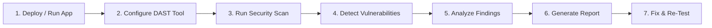

## Python CI Checks | DAST Doc

## Document Information

| **Author** | **Created On** | **Version** | **L0 Reviewer** | **L1 Reviewer** | **L2 Reviewer** |
| ---------------- | -------------------- | ----------------- | --------------------- | --------------------- | --------------------- |
| Amrendra         | 29-09-2026           | 1.0               | Shubham Rathi / Sunny | Shreya J / Nikita     | Piyush Upadhyay       |

---

# Table of Contents

1. [Introduction](#1-introduction)
2. [What is DAST](#2-what-is-dast)
3. [Why DAST](#3-why-dast)
4. [DAST Workflow](#4-dast-workflow)
   - [4.1 Workflow Diagram](#41-workflow-diagram)
   - [4.2 Workflow Explanation](#42-workflow-explanation)
5. [Different Tools for DAST](#5-different-tools-for-dast)
6. [Comparison of DAST Tools](#6-comparison-of-dast-tools)
7. [Advantages of DAST](#7-advantages-of-dast)
8. [Proof of Concept (POC)](#8-proof-of-concept-poc)
9. [Best Practices](#9-best-practices)
10. [Recommendation](#10-recommendation)
11. [Conclusion](#11-conclusion)
12. [Contact Information](#12-contact-information)
13. [References](#13-references)

---

# 1. Introduction

This document provides a guide to implement DAST for Python web services.
It covers security testing for the Attendance API and Notification API.

---

# 2. What is DAST

- DAST stands for **Dynamic Application Security Testing**.
- It is a black-box testing method.
- It tests applications while they are actively running.
- It does not need access to source code.
- It simulates external attacks against open endpoints.

---

# 3. Why DAST

DAST finds runtime security issues that static code analysis cannot detect.

| Reason                          | Description                                           |
| ------------------------------- | ----------------------------------------------------- |
| **Runtime Testing**       | It scans live applications in real environments.      |
| **External Perspective**  | It attacks endpoints like an outsider or hacker.      |
| **Configuration Checks**  | It detects server misconfigurations and weak headers. |
| **No Source Code Needed** | It only requires the target application URL.          |
| **Continuous Security**   | It tests APIs automatically before every release.     |

---

# 4. DAST Workflow

The DAST workflow runs automated security tests against active endpoints and produces actionable findings.

### 4.1 Workflow Diagram

### 4.2 Workflow Explanation

|    Step    | Stage                              | Description                                                               |
| :---------: | ---------------------------------- | ------------------------------------------------------------------------- |
| **1** | **Run Web Application**      | Start the Attendance and Notification APIs in a test environment.         |
| **2** | **Configure DAST Tool**      | Set the API target URLs, Swagger files, and scan rules.                   |
| **3** | **Start Security Scan**      | Run passive and active scans against the endpoints.                       |
| **4** | **Identify Vulnerabilities** | Detect security flaws such as injection, broken headers, or exposed data. |
| **5** | **Analyze Findings**         | Review detected issues and check their severity levels.                   |
| **6** | **Generate Report**          | Create HTML and JSON reports for the team.                                |
| **7** | **Fix & Re-Test**            | Fix the vulnerabilities and re-run the scan to verify the fix.            |

---

# 5. Different Tools for DAST

| Tool                 | Description                                                                                  |
| -------------------- | -------------------------------------------------------------------------------------------- |
| **OWASP ZAP**  | Free, open-source security scanner. Very popular for web applications and REST APIs.         |
| **Burp Suite** | Widely used web security testing tool. Has free community and paid enterprise editions.      |
| **Nuclei**     | Fast, template-based scanner. Good for checking known vulnerabilities and exposed endpoints. |
| **Nikto**      | Simple open-source scanner. Checks web servers for dangerous files and outdated software.    |

---

# 6. Comparison of DAST Tools

| Feature                         | OWASP ZAP              | Burp Suite (Community) | Nuclei                  | Nikto                        |
| ------------------------------- | ---------------------- | ---------------------- | ----------------------- | ---------------------------- |
| **License**               | Open Source (Free)     | Free / Commercial      | Open Source (Free)      | Open Source (Free)           |
| **Primary Focus**         | Web Apps & REST APIs   | Web Security Testing   | Template-Based Scanning | Web Server Misconfigurations |
| **API Support (Swagger)** | Excellent              | Good                   | Basic                   | Poor                         |
| **CI/CD Automation**      | High                   | Low (High in Paid)     | High                    | Medium                       |
| **Report Formats**        | HTML, JSON, XML, SARIF | HTML                   | JSON, Markdown, SARIF   | Text, HTML, XML              |
| **Ease of Setup**         | Easy (Docker ready)    | Moderate               | Very Easy               | Very Easy                    |

---

# 7. Advantages of DAST

| Advantage                      | Description                                                   |
| ------------------------------ | ------------------------------------------------------------- |
| **Finds Runtime Flaws**  | Detects issues that only appear when the service is running.  |
| **Language Independent** | Works the same way for Python, Java, or any other language.   |
| **Low False Positives**  | Only reports vulnerabilities that can be accessed externally. |
| **Automated Scanning**   | Runs automatically inside CI/CD pipelines.                    |
| **Clear Reports**        | Gives exact request and response logs to fix bugs quickly.    |

---

# 8. Proof of Concept (POC)

A Proof of Concept (POC) is performed on the Python-based **Attendance API** and **Notification API**.

Refer to the detailed setup steps and commands in the [Python DAST POC Documentation](./POC/README.md).

---

# 9. Best Practices

| Best Practice                      | Description                                                                 |
| ---------------------------------- | --------------------------------------------------------------------------- |
| **Never Scan Production**    | Always run DAST scans against staging or dedicated test environments.       |
| **Provide API Schema**       | Feed OpenAPI (Swagger) specs to scan all endpoints accurately.              |
| **Start with Passive Scans** | Use passive scans first to avoid sending aggressive attack payloads.        |
| **Run in CI/CD**             | Trigger scans automatically on pull requests and nightly builds.            |
| **Prioritize by Severity**   | Fix Critical and High severity issues first before releasing to production. |

---

# 10. Recommendation

| Parameter                   | Details                                                       |
| --------------------------- | ------------------------------------------------------------- |
| **Recommended Tool**  | **OWASP ZAP**                                           |
| **Target Services**   | Attendance API & Notification API (Python)                    |
| **License Type**      | Open Source (Free)                                            |
| **API Support**       | Native support for OpenAPI / Swagger definitions              |
| **CI/CD Integration** | High (Docker containers ready for automation)                 |
| **Reporting Options** | HTML, JSON, XML, and SARIF                                    |
| **Key Reason**        | Free, easy to automate in pipelines, and actively maintained. |

---

# 11. Conclusion

Dynamic Application Security Testing (DAST) protects our Python microservices by finding vulnerabilities during runtime.

**Chosen Tool:**
We choose **OWASP ZAP** as our DAST tool for both the **Attendance API** and **Notification API**. It is free, supports API automated scans, integrates seamlessly into CI/CD pipelines, and provides clear reports.

---

# 12. Contact Information

|        Name        |          Email Address          |
| :----------------: | :-----------------------------: |
| **Amrendra** | amrendra.snaatak@mygurukulam.co |

---

# 13. References

| Reference            | Link                                                                                    |
| -------------------- | --------------------------------------------------------------------------------------- |
| **OWASP ZAP**  | [ZAP](https://www.zaproxy.org/docs/)                                                     |
| **Burp Suite** | [Burp](https://portswigger.net/burp/documentation)                                       |
| **Nuclei**     | [Nuclei](https://docs.projectdiscovery.io/tools/nuclei)                                  |
| **Nikto**      | [Nikto](https://github.com/sullo/nikto)                                                  |
| **OWASP DAST** | [OWASP](https://owasp.org/www-community/Activities/Dynamic_Application_Security_Testing) |
